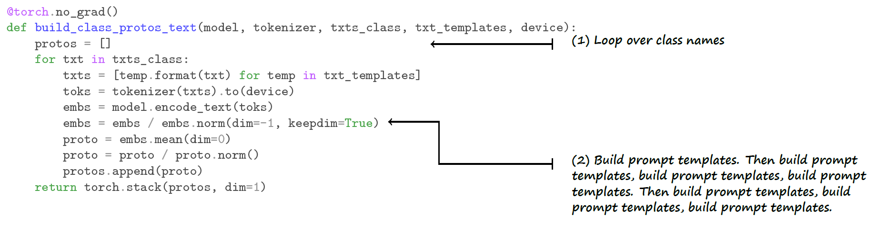

# From Pixels to Prompts:  <small>A Crash Course on Zero-Shot Classification Using Vision-Language Models</small>

This tutorial assumes a general knowledge of deep learning and familiarity with PyTorch

Setup:
1. Pull repo via `git clone xyz`
2. etc
3. Install env
4. etc
5. etc

Recommended resources:
- GPU: x
- RAM: x
- etc.

Note: The environment does not support the newer Hopper nor Blackwell GPU models (H100/H200/B100/B200)

Create and activate environment with: 
`conda env create -f environment.yaml` 
`conda activate imagenet-zeroshot`

This tutorial covers using VLMs to perform zero-shot image classification as well as prompt ensembling to improve performance.

The recommended user setup is to have this document and the jupyter notebook open side by side.

It is recommended to complete the setup steps above, run the notebook, and then proceed to read through the remainder of this tutorial as the notebook is running (it takes about an hour to run (need final time reading for this)).

If one reads through some of the templates, they may seem odd when applied to the majority of images in ImageNet1k e.g. "a tattoo of a {}"(verify) is one of the templates.. Most of the images in ImageNet1k are certainly not tattoos so this is an odd template. However, EXPLANATION ABOUT WHY ENSEMBLING WORKS (produces more well-rounded text representations of class conept)

### ResNet-50

First we benchmark ResNet-50 on the ImageNet1k validation set.

### Class Prototypes

### List Pretrained Models

`open_clip.list_pretrained()` can be executed to view pretrained VLMs available through `open_clip`. Running this function displays architectures along with the dataset it was pretrained on which is needed to initialize the VLM image preprocessor. Unfortunately, this function does not also display the recommended `quick_gelu` setting so that is something the reader will have to look up on their own per model, but in general, the CLIP architectures performed pretraining using QuickGeLU and all the others did not. Typically, models initialized with pretrained weights from OpenAI should use QuickGeLU and all others not, as we will soon see.

Interested readers can learn more about some of the more prominent open-source pretraining datasets at the following links:

- [LAION](https://laion.ai/blog/laion-5b/)
- [CommonPool](https://ar5iv.labs.arxiv.org/html/2304.14108)
- [WebLI](https://research.google/blog/pali-scaling-language-image-learning-in-100-languages/)

`openai` tag --> original CLIP, load's OpenAI's original CLIP weights, these are not "OpenCLIP" models even though they're available through the `open_clip` library. Anything not tagged with `openai` belong to the OpenCLIP family e.g. `laion*`, `commonpool*`, etc, which are checkpoints trained by the community using the OpenCLIP recipes on public datasets.

### VLM Configurations

VLM specs:

| Model                   | Total Parameters | Embedding Dimension |
|-------------------------|------------------|---------------------|
| CLIP ResNet-50 (224px)  | 102M             | 1024                |
| CLIP ViT-B/32 (224px)   | 151M             | 512                 |
| CLIP ViT-B/16 (224px)   | 150M             | 512                 |
| CLIP ViT-L/14 (224px)   | 428M             | 768                 |
| CLIP ViT-L/14 (336px)   | 428M             | 768                 |
| SigLIP ViT-B/16 (224px) | 203M             | 768                 |
| SigLIP ViT-B/16 (256px) | 203M             | 768                 |
| SigLIP ViT-L/16 (256px) | 652M             | 1024                |

### Template Ensembles

### Raw Label Template

### Standard Template

### CLIP 80 Templates

...as described in the [OpenAI notebook](https://colab.research.google.com/github/openai/CLIP/blob/main/notebooks/Prompt_Engineering_for_ImageNet.ipynb).

### Conclusion

| Model                   | Reported ~ CLIP | Reported ~ SigLIP | Results ~ CLIP 80 | Results ~ Standard | Results ~ Raw |
|-------------------------|-----------------|-------------------|-------------------|--------------------|---------------|
| CLIP ResNet-50 (224px)  | 59.6            | --                | 59.8              | 57.9               | 55.3          |
| CLIP ViT-B/32 (224px)   | 63.2            | --                | 63.3              | 61.9               | 59.0          |
| CLIP ViT-B/16 (224px)   | 68.6            | 68.3              | 68.3              | 66.6               | 64.1          |
| CLIP ViT-L/14 (224px)   | 75.3            | 75.5              | 75.5              | 72.9               | 71.6          |
| CLIP ViT-L/14 (336px)   | 76.2            | 76.6              | 76.5              | 74.3               | 73.0          |
| SigLIP ViT-B/16 (224px) | --              | 76.3              | 76.1              | 75.7               | 74.8          |
| SigLIP ViT-B/16 (256px) | --              | 76.6              | 76.5              | 76.3               | 75.2          |
| SigLIP ViT-L/16 (256px) | --              | 80.6              | 80.5              | 79.7               | 78.9          |

Reported ~ CLIP: reported values from Table 11 of the seminal CLIP paper [x].
Reported ~ SigLIP: reported values from Table 3 of the seminal SigLIP paper [x].
Results ~ CLIP 80: results obtained using CLIP 80 Templates
Results ~ Standard: results obtained using standard template
Results ~ Raw: results obtained using raw label template