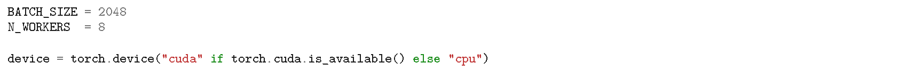

# From Pixels to Prompts:  <small>A Crash Course on Zero-Shot Classification Using Vision-Language Models</small>

This tutorial assumes a general knowledge of modern deep learning and familiarity with PyTorch.

## Setup
1. Pull repo via: `git clone https://github.com/odobon1/vlm-tutorial.git`
2. `cd vlm-tutorial`
3. Install env: `conda env create -f environment.yml`
4. etc
5. etc

Recommended resources:
- GPU: x
- RAM: x
- etc.

Note: The environment does not support the newer Hopper nor Blackwell GPU models (H100/H200/B100/B200)

Create and activate environment with: 
`conda env create -f environment.yaml` 
`conda activate imagenet-zeroshot`

We make use of the following conventions for discussing tensor dimensionality:
* B: Batch dimension i.e. sample dimension (number of samples per mini-batch)
* D: Embedding dimension (dependent on VLM architecture)
* T: Text encoder context length (max text tokens)
* L: Num. classes (1000 for ImageNet1k)
* P: Num. text prompts encoded at once by VLM text encoder
* C: Image channels
* H: Image height
* W: Image width

LVMs broke out onto the scene in early/late 20xx with Radford et al.'s introduction of Contrastive Language-Image Pretraining...

The core components of VLMs are the language and vision encoders.
or
VLMs consist of an image encoder and a text encoder.

In this tutorial, we will be covering the basics of applying VLMs to image classification tasks, guiding the discussion with the reproduction of results from the seminal CLIP and SigLIP papers ([1], [2]).

We will reproduce results from the seminal CLIP and SigLIP papers to guide our discussion and comparison of classical and VLM paradigms. (Make sure this is a correct usage of the term "paradigms")

We will reproduce results from the seminal CLIP and SigLIP papers [1], [2], using the VLMs in image-to-text mode to compare head-to-head with classic single-label classification models, benchmarking ResNet-50 and various VLMs of interest on the validation set of ImageNet1k.

In this tutorial we use a VLM for zero-shot classification, one of their most impressive capabilities.

CLIP and related VLMs are known for their amazing ability to generalize to classes that they have not been trained on, known as zero-shot learning. In this tutorial, we will be walking through how to set up CLIP-style VLMs to do just that.

In this tutorial, we will be covering zero-shot image-to-text inference, but it is good to know that CLIP has many use cases including image-to-image and text-to-image retrieval.

We will be evaluating and comparing VLMs and ResNet-50 [3] on the ImageNet1k [4] validation set. Note that unlike ResNet, which was trained on ImageNet1k, the VLMs weren't exposed to the ImageNet1k train data nor trained to explicitly recognize the 1000 discrete classes. In other words, we will be evaluating the zero-shot performance of the VLMs, baselining against a previously SOTA model that was explicitly trained for the task.

(Make sure to emphasize the fact that zero-shot == the model hasn't been trained on any of the data)

This tutorial covers using VLMs to perform zero-shot image classification as well as prompt ensembling to improve performance.

The recommended user setup is to have this document and the jupyter notebook open side by side.

It is recommended to complete the setup steps above, run the notebook, and then proceed to read through the remainder of this tutorial as the notebook is running (it takes about an hour to run (need final time reading for this)).

OpenAI's CLIP was pretrained on a  set of 400M(?) image-text pairs scraped off the internet.
During pretraining, B image-text pairs are sampled at a time and run through corresponding encoders to produce B text embeddings and B image embeddings. The logits are then computed to assemble a B x B similarity matrix. Along the diagonal (i = j) are the "aligned pairs" ~ the image-text pairs which were scraped from the web. All other elements are non-aligned pairs, where the image and text embeddings of non-corresponding pairs are compared. This is where the "contrastive" component of the name comes from: The majority of image-text pairs per batch are negatives ~ each B x B similarity matrix contains B positives and B^2 - B negatives under the standard pretraining assumption (that only aligned pairs are positives).
VLMs are pretrained to push together aligned image-text pairs and push away non-aligned image-text pairs.

| Model                   | Reported ~ CLIP | Reported ~ SigLIP |
|-------------------------|-----------------|-------------------|
| CLIP ResNet-50 (224px)  | 59.6            | --                |
| CLIP ViT-B/32 (224px)   | 63.2            | --                |
| CLIP ViT-B/16 (224px)   | 68.6            | 68.3              |
| CLIP ViT-L/14 (224px)   | 75.3            | 75.5              |
| CLIP ViT-L/14 (336px)   | 76.2            | 76.6              |
| SigLIP ViT-B/16 (224px) | --              | 76.3              |
| SigLIP ViT-B/16 (256px) | --              | 76.6              |
| SigLIP ViT-L/16 (256px) | --              | 80.6              |

The headliner CLIP results involve a method of feature engineering described in <link>

The CLIP authors describe polysemy issues with the default ImageNet1k labels e.g. "crane" (bird vs. machine), so they curate class labels (one per class) and a set of templates to create a robust set of class prototype text embeddings.

The PACE community maintains a great collection of commonly used benchmark datasets in `/storage/ice1/shared/d-pace_community/makerspace-datasets/`, we will be using ImageNet xxx ... (reference messages w/ Ron)

in this tutorial we will be utilizing the ImageNet1k that is publicly available to PACE members

## Evaluation Utilities

### Imports

### Hardware Config

### Batched Inference: ResNet-50

The code is arranged in such a way to highlight the similarities and differences between classic and VLM paradigms.

A batch of images is run through ResNet-50 to produce logits. Business as usual.

### Batched Inference: VLM

A learnable temperature parameter is used to scale logits during training to adjust the sharpness of xyz, and in the case of SigLIP, a learnable bias applied to xyz.
The raw logits are all we need for inference. During training, logits are scaled with a learnable temperature parameter to adjust the sharpness of xyz and in the case of SigLIP a learnable bias applied to xyz. However, like with softmax and sigmoid activations, these are strictly monotonic functions (ordering of logits is preserved) and are omitted to remain focused on inference for the purposes of this tutorial.
(1) logits are scaled with a temperature parameter during training, which is applied during training to adjust the sharpness of xyz, but for inference it doesn't matter because applying the temperature scaling (and scalar logit bias in the case of SigLIP) doesn't change retrieval ranking i.e. in this case the sorted ordering of class logits (i.e. doesn't change ordering if logits were to be sorted)
Similarly, 

Cosine similarity is an operation that compares the similarity between pairs of vectors. Normalizing vectors to unit length can be thought of as casting them to the D-dimensional unit hypersphere with D-1 degrees of freedom. Cosine similarity can be thought of as a measurement for the degree to which two vectors are pointing in the same direction on the unit hypersphere. A score of 1 indicates they are pointing in exactly the same direction (identical embeddings). A score of 0 indicates orthogonality (perpendicular embeddings). A score of -1 indicates the vectors are pointing in opposite directions (one vector is the negative of the other).
With both vectors normalized to unit length, cosine similarity is equivalent to taking the dot product.

`protos_txt` are the zero-shot classifier, a matrix produced as part of getting the VLM behaving as an image classifier. We will cover the construction of this matrix later.
...not too unlike the operations performed in a standard fully connected layer....

`protos_txt` is a 2D matrix of shape (L, D) consisting of L number of D-dimensional text embeddings, one for each class. For each image embedding, the similarity is measured against all text embeddings and the pair with the highest similarity corresponds to the class prediction for an image.

If you stop and take a second to think about what is being done here, the operation very much resembles the operation performed in a standard linear layer, the ultimate task-specific classification layer in this case. The x is analogous to the x, etc

in a way, the matrix of encoded text embeddings is essentially a matrix that encodes the meaning of each text prompt. Each row of matrix G is an embedding corresponding to a class descriptor prompt
The matrix G acts as a function/operator on image query vector q_hat

If you stop to think about it, what we did here very much resembles the operation performed by a fully connected linear layer, it is a dot product after all. The matrix G acts as an operator on the query embedding vector q_hat the very same way as the matrix of weights W of a fully connected layer acts as an operator on a vector of activations a_hat corresponding to a particular sample. The image embedding is analogous to the vector of activations entering the last task-specific fully connected classification layer, the matrix G of cached text embeddings encoding each class analogous to the last fully connected task-specific classification layer composed of weight matrix W with the individual text embeddings corresponding to particular classes analogous to the weights connecting every input activation to particular output logits. In both cases (VLM vs. classic?), the class corresponding to the maximum logit is considered the prediction.

the only difference is the pretraining process fuses together the latent space across modalities in such a way where the image embedding and corresponding text embedding of the natural language description of the image point in very similar directions.

Pretraining fuses together the latent space between modalities

Temp and bias:
* SigLIP also adds a learnable scalar bias term to logits in addition to temperature-based scaling of logits

During pre-training/fine-tuning, a temperature parameter is applied at this step, but applying it doesn't affect the ordering of retrieval results during inference so explanation of temp param is omitted here but just good to note. 

### Evaluation Loop

Note the evaluation loop is exactly the same for both paradigms except for how logits are computed.

The `batch_prec1()` function takes a batch of logits and corresponding binary targets and computes mean Prec@1.

Because we are only running the VLMs in inference mode, we don't need to run the logits through the activation layers (sigmoid/softmax) or apply the temperature scaling or bias in the case of SigLIP. That is,
Training is off-scope for this tutorial so we will not discuss why temperature/bias exist (perhaps fine-tuning methods will be discussed in a future tutorial)

We will not discuss why these exist in too much detail here, but in a nutshell:
    • temperature is a learnable parameter that adjusts the sharpness of the contrastive learning objective
    • For SigLIP, bias is a learnable parameter that is used as the name suggests and it exists to balance the positive/negative boundary. An interesting note is that one of the seminal SigLIP authors released notes recommending to initialize bias to -10 (sigmoid(-10) = 0) to reflect how the negatives vastly dominate the positives as a way of reducing shock to the system.

However, applying activations + temperature scale + logit bias for SigLIP does not changing the ordering of logits by magnitude, and can thus be omitted from the inference pipeline as we have done here. 
^ briefly mention the existence of temp + bias in the sections before and state they are needed. Provide a brief explanation here. Start with explaining that the activations aren't needed and then tie in the temp + bias.

## ResNet-50

First we benchmark ResNet-50 on the ImageNet1k validation set.

ResNet-50 comes weighing in at 25.6M parameters.

talk about activation functions not being necessary in ResNet function annotations
...in other words, activations + logit conditioning (temp + bias) don't change the argsort of logits, so they don't need to be applied during inference.

Note: we are using ResNet-50 v1 here. A better performing version of ResNet exists, but we will be using the original version as described in the seminal CLIP paper's abstract [1].

## VLMs

First, we will use just the raw, OpenAI-curated ImageNet1k class labels. Then, we will be applying a generic template: "a photo of a {}".
Finally, we will use the CLIP 80 templates described by the authors.

When the VLM is utilized to perform image classification, a representation in the text space is produced for each class. This can be as simple as embedding a single prompt per class e.g. "a photo of a <label>", or methods that produce more robust text embeddings can be used to create better targets, as we will soon see.

Prompt Ensembling adds some additional complexity so we will first first perform inference using a single template per class.

We will use <flagship> model which produces xyz-dimensional embeddings, has xyz layers, x number of parameters, etc.

First, class prototype embeddings are generated for each class (1000 embeddings in this case for ImageNet1k).
Because ImageNet1k contains 1000 classes, this means we'll have 1000 text prototypes.

### Zero-Shot Classifier

...an L x D matrix G where L is the number of classes (1000 in our case) and D is the embedding dimensionality.

### List Pretrained Models

`open_clip.list_pretrained()` can be executed to view pretrained VLMs available through `open_clip`. Running this function displays architectures along with the dataset it was pretrained on which is needed to initialize the VLM image preprocessor. Unfortunately, this function does not also display the recommended `quick_gelu` setting so that is something the reader will have to look up on their own per model, but in general, the CLIP architectures performed pretraining using QuickGeLU and all the others did not. Typically, models initialized with pretrained weights from OpenAI should use QuickGeLU and all others not, as we will soon see.

Explicityly mention: different pretraining datasets can be specified which will result in the corresponding set of weights getting pulled from sources such as Hugging Face Hub.

Interested readers can learn more about some of the more prominent open-source pretraining datasets at the following links:

- [LAION](https://laion.ai/blog/laion-5b/)
- [CommonPool](https://ar5iv.labs.arxiv.org/html/2304.14108)
- [WebLI](https://research.google/blog/pali-scaling-language-image-learning-in-100-languages/)

`openai` tag --> original CLIP, load's OpenAI's original CLIP weights, these are not "OpenCLIP" models even though they're available through the `open_clip` library. Anything not tagged with `openai` belong to the OpenCLIP family e.g. `laion*`, `commonpool*`, etc, which are checkpoints trained by the community using the OpenCLIP recipes on public datasets.

### Flagship CLIP Config

### Zero-Shot Classification: Raw Labels

`img_pp` is the validation image preprocessor which applies transforms to images such that they are in the format expected by the vision encoder.
...(which apply) the same deterministic transformations used during pretraining:
* Decode & color: loads image and converts to 3-channel RGB
* Resize + center crop: resizes image such that shorter size matches target resolution, then applies a center crop to size the image to the vision encoder's expected input size.
* Tensorify: convert to tensor
* Normalize: normalizes values as per the model's expected mean/std

### Zero-Shot Classification: Standard Template

Above, we used just the raw class label to construct the ZS classifier. An easy way to improve performance is through the use of prompt templating, a well-documented method known to lift performance in VLMs.

The code is much like before, but this time we ___

The performance is X. Wow! Amazing!

The norm is to format text inputs with prompt templates such as "a photo of a {}". Although it may seem strange applying the same template to each class label, it is done to make the text more similar to the natural, caption-like sentences that the VLM was pretrained on, which improves zero-shot performance over just using the raw word.

It may seem strange that using a prompt such as "a photo of a {}" would have such a performance increase

### Prompt Ensembling

Prompt Ensembling: encode each templated text with the CLIP text encoder and take the mean of those text embeddings. We refer to these as the "class prototypes", the gallery embeddings

The idea with the ensembling is to put the class label in a variety of contexts and take the average s.t. no single template applies a contextual bias to the text embedding -- averaging over the label in a variety of contexts puts that object in different contexts, creating a more well-rounded representation of that concept in the text space, in addition to any details specific to the context imposed by a given template being almost erased when the average is performed. The template variants diversify wording so the class text prototype embodies a well-rounded representation of the concept and is robust across styles/domains.

One might wonder: Why go through all this trouble? Why not encode just the label itself and call it a day? Well, this would be quite different i.e. out-of-distribution in comparison to the pretraining image-text pairs which are largely (if not entirely) composed of lengthy captions on the text side. Using prompt engineering / templating gives the class concepts some context, much like the majority of instances in the pretraining set were sure to be in some kind of context as opposed to being an image where that object was the only identifiable object (e.g. to a human observer; possible but unlikely). The idea is essentially to reduce the distribution shift between zero-shot prompts and the pretraining corpus.

it's basically to create a prototype of the 

The details of the feature engineering are described by the authors of the seminal CLIP paper at: https://colab.research.google.com/github/openai/CLIP/blob/main/notebooks/Prompt_Engineering_for_ImageNet.ipynb

It may seem quite shocking at first that something as sophisticated as multimodal embeddings, D-dimensional vectors that encode sophisticated representations of concepts in a multimodal latent embedding space, behave in such a way where averaging the embeddings equates to "averaging their concepts", but if you stare at the math pertaining to the sinusoidal encodings described in <link>Attention Is All You Need for long enough, the linear structure of these embeddings will eventually pop out at you. The classic example is emb("king") - emb("man") + emb("woman") roughly points in the direction of emb("queen"). That is, the cosine-similarity between emb("king") - emb("man") + emb("woman") (normalized to unit-length) and emb("queen") should be very close to 1.0 (this is at least the common intuition that applies to token embeddings at least, very curious if it applies to VLM text encoder output embeddings)
^ this applies more so to token embeddings... ran the (king - man + woman = queen) experiment with text encoder output embeddings for those words and the results did not hold (king - man + woman was still more similar to king than to queen), still might be worth a mention but it would have to be worked in carefully

<explain why all the templates are used>

On the text side, a class prototype embedding is generated for each class as follows:
For each class, the label is inserted into 80 prompt templates e.g. "a photo of a {label}", encoded by the VLM's text encoder, averaged, and normalized to unit-length to produce the class prototype text embedding.
A curated list of class names and templates is used to create class prototype embeddings in the text space.

### VLM Configurations

L-variants all have 3-4x the overall network capacity than their B-variant counterparts as well as larger embedding dimensionalities.

Note that many of the variants use the same text encoder architectures which is why VLMs are often denoted with just the name of the vision tower.

VLM specs:

| Model                   | Total   Parameters | Embedding     Dimension |
|-------------------------|-----------------------|----------------------------|
| CLIP ResNet-50 (224px)  | 102M                  | 1024                       |
| CLIP ViT-B/32 (224px)   | 151M                  | 512                        |
| CLIP ViT-B/16 (224px)   | 150M                  | 512                        |
| CLIP ViT-L/14 (224px)   | 428M                  | 768                        |
| CLIP ViT-L/14 (336px)   | 428M                  | 768                        |
| SigLIP ViT-B/16 (224px) | 203M                  | 768                        |
| SigLIP ViT-B/16 (256px) | 203M                  | 768                        |
| SigLIP ViT-L/16 (256px) | 652M                  | 1024                       |

Potential columns to add to the above: pretrain dataset (nah), QuickGeLU (nah), num layers?, blocks?

### Zero-Shot Classification: OpenAI ImageNet1k Templates

If one reads through some of the templates, they may seem odd when applied to the majority of images in ImageNet1k e.g. "a tattoo of a {}"(verify) is one of the templates.. Most of the images in ImageNet1k are certainly not tattoos so this is an odd template. However, EXPLANATION ABOUT WHY ENSEMBLING WORKS (produces more well-rounded text representations of class conept)

...as described in the [OpenAI notebook](https://colab.research.google.com/github/openai/CLIP/blob/main/notebooks/Prompt_Engineering_for_ImageNet.ipynb).

OpenAI's CLIP [Prompt Engineering for ImageNet](https://colab.research.google.com/github/openai/CLIP/blob/main/notebooks/Prompt_Engineering_for_ImageNet.ipynb) notebook walks through the details of curation + ensembling.

`feat_eng.py` contains the 1000 curated class labels and 80 prompt templates from the OpenAI notebook, needed for reproducing ImageNet results.

The lead author of [1] reports that there is about an additional 1% to be eked out, but he got bored once the prompt templates were shaped enough to outperform the original ResNet-50.

This ablation reveals that the CLIP 80 ensemble method produces embeddings that are more similar in the mean to the validation images, which is no surprise considering that the prototype consists of the mean of the class-concept in a variety of contexts, whereas a single prompt embedding could bias the embedding more towards what is interpreted from the single prompt text embedding.

If you dig deep enough into the math and theory of the sinusoidal encodings described in Attention Is All You Need, the linear properties will eventually pop out at you at some point on your trip.

## Conclusion

And that's the magic of how VLMs achieve zero-shot performance competitive with task-specific once-upon-a-time SOTA methods: representations of classes are created in the text space (prototype text embeddings) across which image embeddings are compared against to perform classification.
..any number of classes can be specified and the text labels curated to any level of detail (as long as texts remain within the context length of the text encoder)

<!-- | Model                   | Reported ~ CLIP | Reported ~ SigLIP | Results ~ CLIP 80 | Results ~ Standard | Results ~ Raw |
|-------------------------|-----------------|-------------------|-------------------|--------------------|---------------|
| CLIP ResNet-50 (224px)  | 59.6            | --                | 59.8              | 57.9               | 55.3          |
| CLIP ViT-B/32 (224px)   | 63.2            | --                | 63.3              | 61.9               | 59.0          |
| CLIP ViT-B/16 (224px)   | 68.6            | 68.3              | 68.3              | 66.6               | 64.1          |
| CLIP ViT-L/14 (224px)   | 75.3            | 75.5              | 75.5              | 72.9               | 71.6          |
| CLIP ViT-L/14 (336px)   | 76.2            | 76.6              | 76.5              | 74.3               | 73.0          |
| SigLIP ViT-B/16 (224px) | --              | 76.3              | 76.1              | 75.7               | 74.8          |
| SigLIP ViT-B/16 (256px) | --              | 76.6              | 76.5              | 76.3               | 75.2          |
| SigLIP ViT-L/16 (256px) | --              | 80.6              | 80.5              | 79.7               | 78.9          | 

Reported ~ CLIP: reported values from Table 11 of the seminal CLIP paper [x].
Reported ~ SigLIP: reported values from Table 3 of the seminal SigLIP paper [x].
Results ~ CLIP 80: results obtained using CLIP 80 Templates
Results ~ Standard: results obtained using standard template
Results ~ Raw: results obtained using raw label template -->

| Model                   | Reported ~ CLIP | Reported ~ SigLIP | Reproduced |
|-------------------------|-----------------|-------------------|------------|
| CLIP ResNet-50 (224px)  | 59.6            | --                | 59.8       |
| CLIP ViT-B/32 (224px)   | 63.2            | --                | 63.3       |
| CLIP ViT-B/16 (224px)   | 68.6            | 68.3              | 68.3       |
| CLIP ViT-L/14 (224px)   | 75.3            | 75.5              | 75.5       |
| CLIP ViT-L/14 (336px)   | 76.2            | 76.6              | 76.5       |
| SigLIP ViT-B/16 (224px) | --              | 76.3              | 76.1       |
| SigLIP ViT-B/16 (256px) | --              | 76.6              | 76.5       |
| SigLIP ViT-L/16 (256px) | --              | 80.6              | 80.5       |

Reported ~ CLIP: reported values from Table 11 of the seminal CLIP paper [x].
Reported ~ SigLIP: reported values from Table 3 of the seminal SigLIP paper [x].
Reproduced: results obtained using OpenAI ImageNet1k Templates

The results obtained are close enough to those described in the corresponding seminal works:
ResNet-50/CLIP/SigLIP
Reported/Reproduced

In this tutorial, we explored the similarities between classical and VLM paradigms and explored how VLMs can be applied towards standard image classification. We performed an ablation of the CLIP 80 templates and of standalone ResNet vs. CLIP-ResNet vs. CLIP-ViT.

VLMs such as those covered in this tutorial have a wide range of applications beyond image classification, including:
* Image captioning
* Visual question answering
* Text-to-image generation
* Multimodal retrieval: i2t, i2i, t2i -- for example if you have an image, you can perform a search against a database of 100k (or any amount of) images to retrieve a ranked subset of the most similar images (all gallery images must be encoded by the VLM's image encoder). Similarly, with the entire database of images encoded, referred to as gallery embeddings, you could just as easily encode a text prompt and retrieve images most similar to that prompt (e.g. "Thanksgiving pictures with cousin Jerry" ~~ assuming you fine-tuned on image-text pairs of Jerr).
* And many more

Although CLIP and SigLIP are used identically in inference, their training procedures are quite different.

During training, with galleries that can be composed of varying numbers of same-class items, the softmax-based CLIP and the, err, sigmoid-based SigLIP are very different

There are many considerations to be made. During pretraining, it is assumed that the webscale data consists of unique concepts (no classes), a noisy and imperfect assumption. There may exist semantic similarities across non-aligned image-text pairs that essentially get cast as false negatives.

the CLIP vs. SigLIP conversation doesn't make sense to have here because in this setting the gallery is composed entirely of singletons (wrt class) which is why they are both used identically in terms of just taking the max over logits.

VLMs perform retrieval, which is normally many-to-many. To get the VLMs behaving in a way where they are performing image classification, we structure it as a many-to-one retrieval in the image-to-text direction.
...With targets on deck, taking the max over the logits is all that's needed to compute Prec@1.
...in the image-to-text direction during zero-shot evaluation where the VLM is being utilized in such a way that mimics traditional image classification

Reasoning about how training is performed for CLIP and SigLIP is left as an exercise to the reader (hint: <link>[1], ctrl-f "3.1.1 bidirectional training procedure")