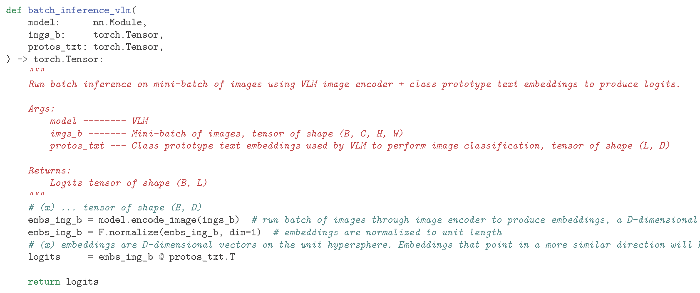

# From Pixels to Prompts:  <small>A Crash Course on Zero-Shot Classification Using Vision-Language Models</small>

This tutorial assumes a general background in deep learning and familiarity with PyTorch

## Setup
1. Pull repo via `git clone xyz`
2. etc
3. Install env
4. etc
5. etc

Recommended resources:
- GPU: x
- RAM: x
- etc.

Note: The environment does not support the newer Hopper nor Blackwell GPU models (H100/H200/B100/B200)

Create and activate environment with: 
`conda env create -f environment.yaml` 
`conda activate imagenet-zeroshot`

Dimension annotations: 
* B: Batch dimension i.e. sample dimension 
* D: Embedding dimension 
* T: Context length (77 for CLIP) 
* L: Num. classes (1000 in this case)

In this tutorial, we will be covering the basics of applying VLMs to image classification tasks, guiding the discussion with the reproduction of results from the seminal CLIP and SigLIP papers ([1], [2]).

We will reproduce results from the seminal CLIP and SigLIP papers to guide our discussion and comparison of classical and VLM paradigms. (Make sure this is a correct usage of the term "paradigms")

We will be evaluating and comparing VLMs and ResNet-50 [3] on the ImageNet1k [4] validation set. Note that unlike ResNet, which was trained on ImageNet1k, the VLMs weren't exposed to the ImageNet1k train data nor trained to explicitly recognize the 1000 discrete classes. In other words, we will be evaluating the zero-shot performance of the VLMs, baselining against a previously SOTA model that was explicitly trained for the task.

(Make sure to emphasize the fact that zero-shot == the model hasn't been trained on any of the data)

This tutorial covers using VLMs to perform zero-shot image classification as well as prompt ensembling to improve performance.

The recommended user setup is to have this document and the jupyter notebook open side by side.

It is recommended to complete the setup steps above, run the notebook, and then proceed to read through the remainder of this tutorial as the notebook is running (it takes about an hour to run (need final time reading for this)).

| Model                   | Reported ~ CLIP | Reported ~ SigLIP |
|-------------------------|-----------------|-------------------|
| CLIP ResNet-50 (224px)  | 59.6            | --                |
| CLIP ViT-B/32 (224px)   | 63.2            | --                |
| CLIP ViT-B/16 (224px)   | 68.6            | 68.3              |
| CLIP ViT-L/14 (224px)   | 75.3            | 75.5              |
| CLIP ViT-L/14 (336px)   | 76.2            | 76.6              |
| SigLIP ViT-B/16 (224px) | --              | 76.3              |
| SigLIP ViT-B/16 (256px) | --              | 76.6              |
| SigLIP ViT-L/16 (256px) | --              | 80.6              |

## Evaluation Utilities

### Imports

### Hardware Config

### Batched Inference: ResNet-50

The code is arranged in such a way to highlight the similarities and differences between classic and VLM paradigms.

A batch of images is run through ResNet-50 to produce logits. Business as usual.

### Batched Inference: VLM

A learnable temperature parameter is used to scale logits during training to adjust the sharpness of xyz, and in the case of SigLIP, a learnable bias applied to xyz.
The raw logits are all we need for inference. During training, logits are scaled with a learnable temperature parameter to adjust the sharpness of xyz and in the case of SigLIP a learnable bias applied to xyz. However, like with softmax and sigmoid activations, these are strictly monotonic functions (ordering of logits is preserved) and are omitted to remain focused on inference for the purposes of this tutorial.
(1) logits are scaled with a temperature parameter during training, which is applied during training to adjust the sharpness of xyz, but for inference it doesn't matter because applying the temperature scaling (and scalar logit bias in the case of SigLIP) doesn't change retrieval ranking i.e. in this case the sorted ordering of class logits (i.e. doesn't change ordering if logits were to be sorted)
Similarly, 

### Evaluation Loop

Note the evaluation loop is exactly the same for both paradigms except for how logits are computed.

## ResNet-50

First we benchmark ResNet-50 on the ImageNet1k validation set.

ResNet-50 comes weighing in at 25.6M parameters.

talk about activation functions not being necessary in ResNet function annotations

## VLMs

First, we will use just the raw, OpenAI-curated ImageNet1k class labels. Then, we will be applying a generic template: "a photo of a {}".
Finally, we will use the CLIP 80 templates described by the authors.

### Zero-Shot Classifier

### List Pretrained Models

`open_clip.list_pretrained()` can be executed to view pretrained VLMs available through `open_clip`. Running this function displays architectures along with the dataset it was pretrained on which is needed to initialize the VLM image preprocessor. Unfortunately, this function does not also display the recommended `quick_gelu` setting so that is something the reader will have to look up on their own per model, but in general, the CLIP architectures performed pretraining using QuickGeLU and all the others did not. Typically, models initialized with pretrained weights from OpenAI should use QuickGeLU and all others not, as we will soon see.

Explicityly mention: different pretraining datasets can be specified which will result in the corresponding set of weights getting pulled from Hugging Face Hub.

Interested readers can learn more about some of the more prominent open-source pretraining datasets at the following links:

- [LAION](https://laion.ai/blog/laion-5b/)
- [CommonPool](https://ar5iv.labs.arxiv.org/html/2304.14108)
- [WebLI](https://research.google/blog/pali-scaling-language-image-learning-in-100-languages/)

`openai` tag --> original CLIP, load's OpenAI's original CLIP weights, these are not "OpenCLIP" models even though they're available through the `open_clip` library. Anything not tagged with `openai` belong to the OpenCLIP family e.g. `laion*`, `commonpool*`, etc, which are checkpoints trained by the community using the OpenCLIP recipes on public datasets.

### Flagship CLIP Config

### Zero-Shot Classification: Raw Labels

### Zero-Shot Classification: Standard Template

Above, we used just the raw class label to construct the ZS classifier. An easy way to improve performance is through the use of prompt templating, a well-documented method known to lift performance in VLMs.

The performance is X. Wow! Amazing!

The norm is to format text inputs with prompt templates such a "a photo of a {}". Although it may seem strange applying the same template to each class label, it is done to make the text more similar to the natural, caption-like sentences that the VLM was pretrained on, which improves zero-shot performance over just using the raw word.

It may seem strange that using a prompt such as "a photo of a {}" would have such a performance increase

### Template Prompt Ensembling

### VLM Configurations

L-variants all have 3-4x the overall network capacity than their B-variant counterparts as well as larger embedding dimensionalities.

Note that many of the variants use the same text encoder architectures which is why VLMs are often denoted with just the name of the vision tower.

VLM specs:

| Model                   | Total   Parameters | Embedding     Dimension |
|-------------------------|-----------------------|----------------------------|
| CLIP ResNet-50 (224px)  | 102M                  | 1024                       |
| CLIP ViT-B/32 (224px)   | 151M                  | 512                        |
| CLIP ViT-B/16 (224px)   | 150M                  | 512                        |
| CLIP ViT-L/14 (224px)   | 428M                  | 768                        |
| CLIP ViT-L/14 (336px)   | 428M                  | 768                        |
| SigLIP ViT-B/16 (224px) | 203M                  | 768                        |
| SigLIP ViT-B/16 (256px) | 203M                  | 768                        |
| SigLIP ViT-L/16 (256px) | 652M                  | 1024                       |

Potential columns to add to the above: pretrain dataset (nah), QuickGeLU (nah), num layers?

### Zero-Shot Classification: OpenAI ImageNet1k Templates

If one reads through some of the templates, they may seem odd when applied to the majority of images in ImageNet1k e.g. "a tattoo of a {}"(verify) is one of the templates.. Most of the images in ImageNet1k are certainly not tattoos so this is an odd template. However, EXPLANATION ABOUT WHY ENSEMBLING WORKS (produces more well-rounded text representations of class conept)

...as described in the [OpenAI notebook](https://colab.research.google.com/github/openai/CLIP/blob/main/notebooks/Prompt_Engineering_for_ImageNet.ipynb).

The lead author of [1] reports that there is about an additional 1% to be eked out, but he got bored once the prompt templates were shaped enough to outperform the original ResNet-50.

## Conclusion

<!-- | Model                   | Reported ~ CLIP | Reported ~ SigLIP | Results ~ CLIP 80 | Results ~ Standard | Results ~ Raw |
|-------------------------|-----------------|-------------------|-------------------|--------------------|---------------|
| CLIP ResNet-50 (224px)  | 59.6            | --                | 59.8              | 57.9               | 55.3          |
| CLIP ViT-B/32 (224px)   | 63.2            | --                | 63.3              | 61.9               | 59.0          |
| CLIP ViT-B/16 (224px)   | 68.6            | 68.3              | 68.3              | 66.6               | 64.1          |
| CLIP ViT-L/14 (224px)   | 75.3            | 75.5              | 75.5              | 72.9               | 71.6          |
| CLIP ViT-L/14 (336px)   | 76.2            | 76.6              | 76.5              | 74.3               | 73.0          |
| SigLIP ViT-B/16 (224px) | --              | 76.3              | 76.1              | 75.7               | 74.8          |
| SigLIP ViT-B/16 (256px) | --              | 76.6              | 76.5              | 76.3               | 75.2          |
| SigLIP ViT-L/16 (256px) | --              | 80.6              | 80.5              | 79.7               | 78.9          | 

Reported ~ CLIP: reported values from Table 11 of the seminal CLIP paper [x].
Reported ~ SigLIP: reported values from Table 3 of the seminal SigLIP paper [x].
Results ~ CLIP 80: results obtained using CLIP 80 Templates
Results ~ Standard: results obtained using standard template
Results ~ Raw: results obtained using raw label template -->

| Model                   | Reported ~ CLIP | Reported ~ SigLIP | Reproduced |
|-------------------------|-----------------|-------------------|------------|
| CLIP ResNet-50 (224px)  | 59.6            | --                | 59.8       |
| CLIP ViT-B/32 (224px)   | 63.2            | --                | 63.3       |
| CLIP ViT-B/16 (224px)   | 68.6            | 68.3              | 68.3       |
| CLIP ViT-L/14 (224px)   | 75.3            | 75.5              | 75.5       |
| CLIP ViT-L/14 (336px)   | 76.2            | 76.6              | 76.5       |
| SigLIP ViT-B/16 (224px) | --              | 76.3              | 76.1       |
| SigLIP ViT-B/16 (256px) | --              | 76.6              | 76.5       |
| SigLIP ViT-L/16 (256px) | --              | 80.6              | 80.5       |

Reported ~ CLIP: reported values from Table 11 of the seminal CLIP paper [x].
Reported ~ SigLIP: reported values from Table 3 of the seminal SigLIP paper [x].
Reproduced: results obtained using OpenAI ImageNet1k Templates

In this tutorial, we explored the similarities between classical and VLM paradigms and explored how VLMs can be applied towards standard image classification. We performed an ablation of the CLIP 80 templates and of standalone ResNet vs. CLIP-ResNet vs. CLIP-ViT.

VLMs such as those covered in this tutorial have a wide range of applications beyond image classification, including:
* Image captioning
* Visual question answering
* Text-to-image generation