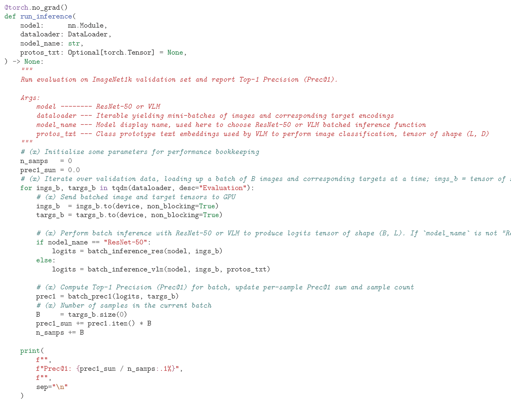
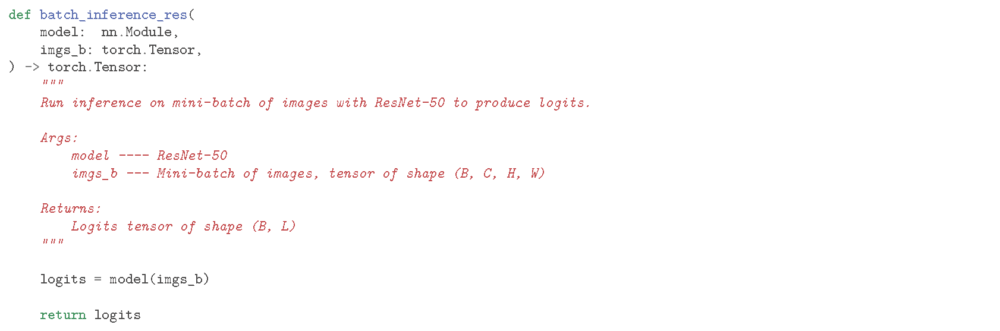
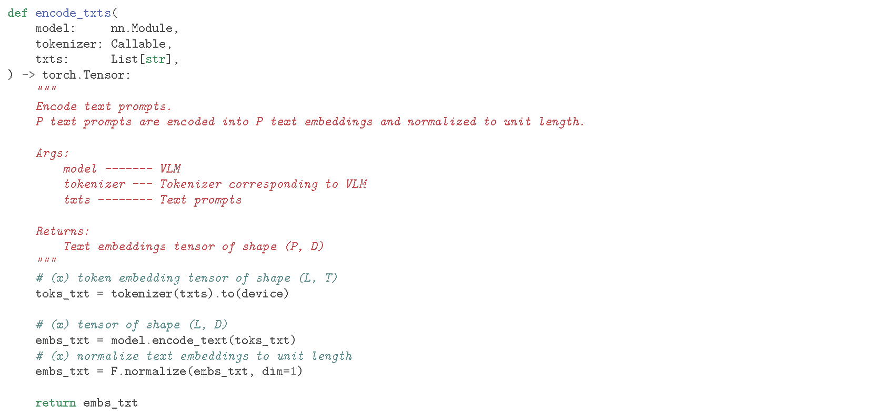
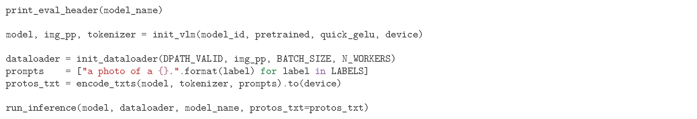
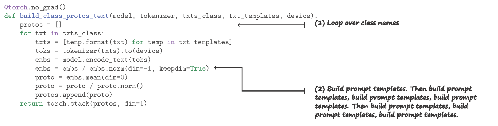

# From Pixels to Prompts:  <small>A Crash Course on Zero-Shot Classification Using Vision-Language Models</small>

This document has been created by researchers in the [Human-Augmented Analytics Group (HAAG)](https://sites.gatech.edu/human-augmented-analytics-group/) for the benefit of the wider PACE community.

This guide walks through performing zero-shot image classification using VLMs, benchmarking against the ImageNet1k dataset provided by the [PACE AI Makerspace](https://gatech.service-now.com/home?id=kb_article_view&sysparm_article=KB0043842).

## Setup

Recommended resources:
- GPU: x
- RAM: x
- etc.

1. Pull repo: 
`git clone https://github.com/odobon1/vlm-tutorial.git`
2. Navigate: 
`cd vlm-tutorial`
3. Create env: 
`conda env create -f environment.yml`
4. Activate env: 
`conda activate imagenet-zeroshot`

Note: This environment does not support Hopper/Blackwell GPUs (H100/H200/B100/B200).

#### Setup stuff

Tip: Keep this document and the Jupyter notebook open side-by-side. Complete the setup above, kick off the notebook, then read through the tutorial as the notebook runs.

## Intro

This tutorial assumes a general knowledge of modern deep learning and familiarity with PyTorch.

#### Hook

Vision-Language Models (VLMs) went mainstream in early 2021 with Radford et al.'s introduction of Contrastive Language-Image Pretraining (CLIP) [1], setting a new bar for zero-shot recognition.
This breakthrough sparked a wave of research on cross-modal contrastive pretraining, yielding a family of models with many impressive capabilities such as predicting classes without any task-specific training.
In this tutorial, we demystify that capability: we'll walk through synthesizing class prototypes from natural language prompts via the VLM's text encoder, scoring images by cosine similarity, and improving performance via templating and prompt ensembling.

#### Explaining VLMs

VLMs are known for their robustness to distribution shift and remarkable zero-shot learning capabilities.

At a high level, a VLM consists of an image encoder and a text encoder (colloquially, the vision and text towers), which are jointly pretrained with a contrastive loss on a large number of image-text pairs scraped from the web to produce a shared, multimodal embedding space that groups/separates similar/dissimilar concepts across vision and language. By leveraging natural language supervision, VLMs learn semantically rich representations that capture fine-grained relationships between images and text, unlocking reliable zero-shot transfer competitive with fully supervised baselines. In other words, given a new dataset, VLMs generalize to the never-before-seen classes without any additional training and outperform previously state-of-the-art (SOTA) fully supervised models trained specifically for that task. That's **zero-shot learning**: predicting classes the model was never trained on. Natural language class labels are processed by the text encoder to synthesize a task-specific classifier on the fly.

VLMs consist of an image encoder and a text encoder. Their contrastive pretraining objective maximizes(minimizes) the cosine similarity between corresponding(non-corresponding) image-text pairs scraped from the web, producing a shared latent space that glues together vision and language modalities, capturing fine-grained relationships across images and text.

Text transformers are used for the text encoder.

Vision Transformers (ViTs) are commonly used for the vision encoder, although there are ResNet-based variants as well.

#### What we'll be doing in this tutorial

In this tutorial, we will be covering the basics of applying VLMs to image classification tasks, guiding our discussion and comparison of classic and VLM paradigms with the reproduction of results from the seminal CLIP [1] and SigLIP [2] papers, with a particular focus on the headliner results from the CLIP paper abstract: CLIP zero-shot outperforming ResNet-50 on ImageNet1k, which ResNet-50 was specifically trained on. We will be following the convention used in the CLIP paper and use *CLIP* to refer to the ViT-L/14 (336px) variant unlessed otherwise specified.

In this tutorial, we will be doing xyz and setting up a basic evaluation pipeline to measure Top-1 Precision on the ImageNet1k validation set. The code is set up in such a way to highlight the similarities and differences between performing image classification with standard models vs. VLMs. To use VLMs for image classification, we leverage the VLM image-to-text capability.

We will benchmark ResNet-50 and various VLMs of interest on the validation set of ImageNet1k.

In this tutorial we use a VLM for zero-shot classification, one of their most impressive capabilities.

We will be evaluating and comparing VLMs and ResNet-50 [3] on the ImageNet1k [4] validation set. Note that unlike ResNet, which was trained on ImageNet1k, the VLMs weren't exposed to the ImageNet1k train data nor trained to explicitly recognize the 1000 discrete classes. In other words, we will be evaluating the zero-shot performance of the VLMs, baselining against a previously SOTA model that was explicitly trained for the task to reproduce the results from the CLIP paper abstract.

The original ResNet-50 scored 75.3% Prec@1 on ImageNet1k as per the [official code release docs](https://github.com/KaimingHe/deep-residual-networks) of the seminal ResNet paper [3].

We will be utilizing the PACE community copy of the ImageNet1k validation set located at `/storage/ice1/shared/d-pace_community/makerspace-datasets/`.

In this tutorial, we have two targets: 
**Primary target**: reproducing the headliner results from the CLIP abstract, the flagship CLIP ViT-L/14 (336px) model outperforming ResNet-50 on ImageNet1k without having seen any of the data. 
**Secondary target**: reproduce results of different variants reported on in the seminal works that are also available through the `open_clip` library, just for good measure.

Below are Prec@1 results reported on in the seminal CLIP and SigLIP papers for 1 ResNet-based and 7 ViT-based VLMs, which we will be reproducing as per our secondary target.

| Model                   | Reported   (Seminal CLIP) | Reported   (Seminal SigLIP) |
|-------------------------|------------------------------|--------------------------------|
| CLIP ResNet-50 (224px)  | 59.6                         | --                             |
| CLIP ViT-B/32 (224px)   | 63.2                         | --                             |
| CLIP ViT-B/16 (224px)   | 68.6                         | 68.3                           |
| CLIP ViT-L/14 (224px)   | 75.3                         | 75.5                           |
| CLIP ViT-L/14 (336px)   | 76.2                         | 76.6                           |
| SigLIP ViT-B/16 (224px) | --                           | 76.3                           |
| SigLIP ViT-B/16 (256px) | --                           | 76.6                           |
| SigLIP ViT-L/16 (256px) | --                           | 80.6                           |

The results in the table above are pulled from Table X of [1] and Table X of [2].

Notice how the 3 overlapping results for the same models slightly vary between papers. There are a number of things we could attribute this drift to, but the moral of the story is: it happens.

Note: CLIP ResNet-50 shouldn't be confused with the standalone ResNet-50. "ResNet-50" will be used to refer to standalone ResNet-50 and "CLIP ResNet-50" will be used to refer to the VLM that uses ResNet-50 as the vision tower.

We will use the following conventions for discussing tensor dimensionality:
* B: Batch dimension i.e. sample dimension (number of samples per mini-batch)
* D: Embedding dimension (dependent on VLM architecture)
* T: Text encoder context length (max text tokens)
* L: Num. classes (1000 for ImageNet1k)
* P: Num. text prompts encoded at once by VLM text encoder
* C: Image channels
* H: Image height
* W: Image width

## Environment & Runtime Setup

### Imports

### Hardware Config

Here we set mini-batch size, number of workers, and device. These are details we can sweep aside, the parameters are set so the tutorial works right if the recommended setup is adhered to.

## Evaluation Loop

The evaluation loop implemented below will be used to evaluate Prec@1 of ResNet-50 and VLMs on ImageNet1k. We iterate over mini-batches of images and corresponding targets. Images are processed by the model to produce logits, which are then scored against the targets. Average Prec@1 is displayed at the end. Note the evaluation loop is exactly the same for classic and VLM paradigms except for how logits are computed.

Because softmax (ResNet-50, CLIP) and sigmoid (SigLIP) activation functions are strictly monotonic (ordering is preserved), they need not be applied to the logits during inference.

## ResNet-50

First, we will benchmark ResNet-50 on the ImageNet1k validation set.

ResNet-50 comes weighing in at 25.6M parameters.

### Batched Inference: ResNet-50

In the standard setup, the model already is a classifier. Given a mini-batch of images `imgs_b` of shape (B, C, H, W), ResNet-50 produces class logits of shape (B, L) in a single forward pass.

### ResNet-50 Evaluation

We initialize ResNet-50 and it's validation preprocessor, build the data loader, and evaluate the model on ImageNet1k.

Note: we are using ResNet-50 v1 here. A better performing version of ResNet exists, but we will be using the original version (v1) that is referenced in the seminal CLIP paper's abstract [1].

Prec@1 = 76.2%, not an exact match with the 75.3% reported in the seminal work, but close enough.

## VLMs

In addition to the broad overview of performing zero-shot classification with VLMs, we will also cover prompt ensembling which is a method needed to reproduce the headliner results from the CLIP abstract. Along the way, we'll ablate different prompt templates and observe performance impact. First, we will use just the raw, OpenAI-curated ImageNet1k class labels (the template simply being the label itself). Then, we will be applying the standard template "a photo of a {}.". Finally, we will apply template ensembling using the OpenAI CLIP Templates described by the authors to (spoiler alert) obtain the desired results.

For our initial leg of experimentation, we will only be evaluating the flagship CLIP ViT-L/14 (336px).

### Zero-Shot Classifier

Before discussing performing batched inference with VLMs, we will cover the construction of the prototype matrix i.e. zero-shot classifier.

It is pretty straightforward: the P texts are tokenized, encoded, and normalized to unit-length to produce our text embedding matrix of shape (P, D).

In the case of single templates being used, we will encode all of our class labels at once (P, the number of prompts being encoded, is our number of classes i.e. P = L). That is, the text embedding matrix produced by `encode_txts()` *is* our prototype matrix. In the case of template ensembling, we will encode multiple templates corresponding to one class at a time, in which case the text embedding matrix produced by `encode_txts()` corresponds to a single class (P != L). More on that later.

...an L x D matrix G where L is the number of classes (1000 in our case) and D is the embedding dimensionality.

### Batched Inference: VLM

The first step to performing zero-shot image classification with a VLM is to build the zero-shot classifier: a matrix (L, D) of text embeddings which we will refer to as **class prototypes**, `protos_txt` in the code below. We will cover the construction of these class prototypes further along.

Class prototype text embeddings are representations of classes across which similarity with image embeddings is compared. Need to establish this is a multimodal latent space we're talking about here by this point.

Image embeddings corresponding to the mini-batch of images are produced with the image encoder. These image embeddings are then normalized to unit length and the cosine similarity computed between every pair of normalized image and text embeddings to produce the logits.

Brief explanation on intuition of cosine similarity here.

### List Pretrained Models

returns a list of 2-element tuples where the first is a model identifier strings which specifies VLM architecture and the second element specifies pretraining dataset that the VLM was pretrained on.

`open_clip.list_pretrained()` can be executed to view pretrained VLMs available through `open_clip`. Running this function displays architectures along with the dataset it was pretrained on which is needed to initialize the VLM image preprocessor. Unfortunately, this function does not also display the recommended `quick_gelu` setting so that is something the reader will have to look up on their own per model, but in general, the CLIP architectures performed pretraining using QuickGeLU and all the others did not. Typically, models initialized with pretrained weights from OpenAI should use QuickGeLU and all others not, as we will soon see.

Explicityly mention: different pretraining datasets can be specified which will result in the corresponding set of weights getting pulled from sources such as Hugging Face Hub.

Interested readers can learn more about some of the more prominent open-source pretraining datasets at the following links:

- [LAION](https://laion.ai/blog/laion-5b/)
- [CommonPool](https://ar5iv.labs.arxiv.org/html/2304.14108)
- [WebLI](https://research.google/blog/pali-scaling-language-image-learning-in-100-languages/)

`openai` tag --> original CLIP, load's OpenAI's original CLIP weights, these are not "OpenCLIP" models even though they're available through the `open_clip` library. Anything not tagged with `openai` belong to the OpenCLIP family e.g. `laion*`, `commonpool*`, etc, which are checkpoints trained by the community using the OpenCLIP recipes on public datasets.

wrt QuickGeLU: In most cases a warning will be printed if the QuickGeLU argument conflicts with what was used during pretraining, but it is advised to look up what is appropriate for a given model.

### Flagship CLIP Config

### VLM Zero-Shot Evaluation: Raw Labels

The CLIP authors describe polysemy issues with the default ImageNet1k labels e.g. "crane" (bird vs. machine), so they curate class labels (one per class) and a set of templates to create a robust set of class prototype text embeddings.

Class prototype embeddings are generated for each class (1000 embeddings in this case for ImageNet1k). Because ImageNet1k has 1000 classes, we'll have 1000 text prototypes.

Prec@1 = 73.0%  
This is somewhat close to our 76.3% target (ResNet-50), but there is still room for improvement.

`img_pp` is the validation image preprocessor which applies transforms to images such that they are in the format expected by the vision encoder.
...(which apply) the same deterministic transformations used during pretraining:
* Decode & color: loads image and converts to 3-channel RGB
* Resize + center crop: resizes image such that shorter size matches target resolution, then applies a center crop to size the image to the vision encoder's expected input size.
* Tensorify: convert to tensor
* Normalize: normalizes values as per the model's expected mean/std

### VLM Zero-Shot Evaluation: Standard Template

An easy way to lift performance is to apply prompt templating, a well-documented method known to improve VLM performance.

The code is much like before, except this time we apply the template "a photo of a {}." to every class label before running through the text encoder to produce our zero-shot classifier.

The norm is to format text inputs with prompt templates such as "a photo of a {}". Although it may seem strange applying the same template to each class label, it is done to make the text more similar to the natural, caption-like sentences that the VLM was pretrained on, which improves zero-shot performance over just using the raw word.

It may seem strange that using a prompt such as "a photo of a {}." yields such a performance increase.

Prec@1 = 74.9%, a noticeable improvement over 73.0% considering the simplicity of the changes. However, we have still not outperformed the ResNet-50 results. To do this, we will need to leverage the same technique used by the authors of the seminal CLIP: prompt ensembling.

### Prompt Ensembling

Prompt Ensembling: encode each templated text with the CLIP text encoder and take the mean of those text embeddings. We refer to these as the "class prototypes", the gallery embeddings

The idea with the ensembling is to put the class label in a variety of contexts and take the average s.t. no single template applies a contextual bias to the text embedding -- averaging over the label in a variety of contexts puts that object in different contexts, creating a more well-rounded representation of that concept in the text space, in addition to any details specific to the context imposed by a given template being almost erased when the average is performed. The template variants diversify wording so the class text prototype embodies a well-rounded representation of the concept and is robust across styles/domains.

One might wonder: Why go through all this trouble? Why not encode just the label itself and call it a day? Well, this would be quite different i.e. out-of-distribution in comparison to the pretraining image-text pairs which are largely (if not entirely) composed of lengthy captions on the text side. Using prompt engineering / templating gives the class concepts some context, much like the majority of instances in the pretraining set were sure to be in some kind of context as opposed to being an image where that object was the only identifiable object (e.g. to a human observer; possible but unlikely). The idea is essentially to reduce the distribution shift between zero-shot prompts and the pretraining corpus.

it's basically to create a prototype of the 

The details of the feature engineering are described by the authors of the seminal CLIP paper at: https://colab.research.google.com/github/openai/CLIP/blob/main/notebooks/Prompt_Engineering_for_ImageNet.ipynb

It may seem quite shocking at first that something as sophisticated as multimodal embeddings, D-dimensional vectors that encode sophisticated representations of concepts in a multimodal latent embedding space, behave in such a way where averaging the embeddings equates to "averaging their concepts", but if you stare at the math pertaining to the sinusoidal encodings described in <link>Attention Is All You Need for long enough, the linear structure of these embeddings will eventually pop out at you. The classic example is emb("king") - emb("man") + emb("woman") roughly points in the direction of emb("queen"). That is, the cosine-similarity between emb("king") - emb("man") + emb("woman") (normalized to unit-length) and emb("queen") should be very close to 1.0 (this is at least the common intuition that applies to token embeddings at least, very curious if it applies to VLM text encoder output embeddings)
^ this applies more so to token embeddings... ran the (king - man + woman = queen) experiment with text encoder output embeddings for those words and the results did not hold (king - man + woman was still more similar to king than to queen), still might be worth a mention but it would have to be worked in carefully

<explain why all the templates are used>

On the text side, a class prototype embedding is generated for each class as follows:
For each class, the label is inserted into 80 prompt templates e.g. "a photo of a {label}", encoded by the VLM's text encoder, averaged, and normalized to unit-length to produce the class prototype text embedding.
A curated list of class names and templates is used to create class prototype embeddings in the text space.

### VLM Configurations

L-variants all have 3-4x the overall network capacity than their B-variant counterparts as well as larger embedding dimensionalities.

Note that many of the variants use the same text encoder architectures which is why VLMs are often denoted with just the name of the vision tower.

VLM specs:

| Model                   | Total   Parameters | Embedding     Dimension |
|-------------------------|-----------------------|----------------------------|
| CLIP ResNet-50 (224px)  | 102M                  | 1024                       |
| CLIP ViT-B/32 (224px)   | 151M                  | 512                        |
| CLIP ViT-B/16 (224px)   | 150M                  | 512                        |
| CLIP ViT-L/14 (224px)   | 428M                  | 768                        |
| CLIP ViT-L/14 (336px)   | 428M                  | 768                        |
| SigLIP ViT-B/16 (224px) | 203M                  | 768                        |
| SigLIP ViT-B/16 (256px) | 203M                  | 768                        |
| SigLIP ViT-L/16 (256px) | 652M                  | 1024                       |

Potential columns to add to the above: pretrain dataset (nah), QuickGeLU (nah), num layers?, blocks?

### VLM Zero-Shot Evaluation: OpenAI ImageNet1k Templates

The headliner CLIP results involve a method of feature engineering described in <link>

If one reads through some of the templates, they may seem odd when applied to the majority of images in ImageNet1k e.g. "a tattoo of a {}"(verify) is one of the templates.. Most of the images in ImageNet1k are certainly not tattoos so this is an odd template. However, EXPLANATION ABOUT WHY ENSEMBLING WORKS (produces more well-rounded text representations of class conept)

...as described in the [OpenAI notebook](https://colab.research.google.com/github/openai/CLIP/blob/main/notebooks/Prompt_Engineering_for_ImageNet.ipynb).

OpenAI's CLIP [Prompt Engineering for ImageNet](https://colab.research.google.com/github/openai/CLIP/blob/main/notebooks/Prompt_Engineering_for_ImageNet.ipynb) notebook walks through the details of curation + ensembling.

`feat_eng.py` contains the 1000 curated class labels and 80 prompt templates from the OpenAI notebook, needed for reproducing ImageNet results.

The lead author of [1] reports that there is about an additional 1% to be eked out from further engineering the prompt templates, but that he got bored once the templates were shaped up to the point that CLIP outperforms ResNet-50.

This ablation reveals that the CLIP 80 ensemble method produces embeddings that are more similar in the mean to the validation images, which is no surprise considering that the prototype consists of the mean of the class-concept in a variety of contexts, whereas a single prompt embedding could bias the embedding more towards what is interpreted from the single prompt text embedding.

If you dig deep enough into the math and theory of the sinusoidal encodings described in Attention Is All You Need, the linear properties will eventually pop out at you at some point on your trip.

## Conclusion

And that's the magic of how VLMs achieve zero-shot performance competitive with task-specific once-upon-a-time SOTA methods: representations of classes are created in the text space (prototype text embeddings) across which image embeddings are compared against to perform classification.
..any number of classes can be specified and the text labels curated to any level of detail (as long as texts remain within the context length of the text encoder)

<!-- | Model                   | Reported ~ CLIP | Reported ~ SigLIP | Results ~ CLIP 80 | Results ~ Standard | Results ~ Raw |
|-------------------------|-----------------|-------------------|-------------------|--------------------|---------------|
| CLIP ResNet-50 (224px)  | 59.6            | --                | 59.8              | 57.9               | 55.3          |
| CLIP ViT-B/32 (224px)   | 63.2            | --                | 63.3              | 61.9               | 59.0          |
| CLIP ViT-B/16 (224px)   | 68.6            | 68.3              | 68.3              | 66.6               | 64.1          |
| CLIP ViT-L/14 (224px)   | 75.3            | 75.5              | 75.5              | 72.9               | 71.6          |
| CLIP ViT-L/14 (336px)   | 76.2            | 76.6              | 76.5              | 74.3               | 73.0          |
| SigLIP ViT-B/16 (224px) | --              | 76.3              | 76.1              | 75.7               | 74.8          |
| SigLIP ViT-B/16 (256px) | --              | 76.6              | 76.5              | 76.3               | 75.2          |
| SigLIP ViT-L/16 (256px) | --              | 80.6              | 80.5              | 79.7               | 78.9          | 

Reported ~ CLIP: reported values from Table 11 of the seminal CLIP paper [x].
Reported ~ SigLIP: reported values from Table 3 of the seminal SigLIP paper [x].
Results ~ CLIP 80: results obtained using CLIP 80 Templates
Results ~ Standard: results obtained using standard template
Results ~ Raw: results obtained using raw label template -->

| Model                   | Reported ~ CLIP | Reported ~ SigLIP | Reproduced |
|-------------------------|-----------------|-------------------|------------|
| CLIP ResNet-50 (224px)  | 59.6            | --                | 59.8       |
| CLIP ViT-B/32 (224px)   | 63.2            | --                | 63.3       |
| CLIP ViT-B/16 (224px)   | 68.6            | 68.3              | 68.3       |
| CLIP ViT-L/14 (224px)   | 75.3            | 75.5              | 75.5       |
| CLIP ViT-L/14 (336px)   | 76.2            | 76.6              | 76.5       |
| SigLIP ViT-B/16 (224px) | --              | 76.3              | 76.1       |
| SigLIP ViT-B/16 (256px) | --              | 76.6              | 76.5       |
| SigLIP ViT-L/16 (256px) | --              | 80.6              | 80.5       |

Reported ~ CLIP: reported values from Table 11 of the seminal CLIP paper [x].
Reported ~ SigLIP: reported values from Table 3 of the seminal SigLIP paper [x].
Reproduced: results obtained using OpenAI ImageNet1k Templates

The results obtained are close enough to those described in the corresponding seminal works:
ResNet-50/CLIP/SigLIP
Reported/Reproduced

In this tutorial, we explored the similarities between classic and VLM paradigms and explored how VLMs can be applied towards standard image classification. We performed an ablation of the CLIP 80 templates and of standalone ResNet vs. CLIP-ResNet vs. CLIP-ViT.

VLMs such as those covered in this tutorial have a wide range of applications beyond image classification, including:
* Image captioning
* Visual question answering
* Text-to-image generation
* Multimodal retrieval: i2t, i2i, t2i -- for example if you have an image, you can perform a search against a database of 100k (or any amount of) images to retrieve a ranked subset of the most similar images (all gallery images must be encoded by the VLM's image encoder). Similarly, with the entire database of images encoded, referred to as gallery embeddings, you could just as easily encode a text prompt and retrieve images most similar to that prompt (e.g. "Thanksgiving pictures with cousin Jerry" ~~ assuming you fine-tuned on image-text pairs of Jerr).
* And many more

Although CLIP and SigLIP are used identically in inference, their training procedures are quite different.

During training, with galleries that can be composed of varying numbers of same-class items, the softmax-based CLIP and the, err, sigmoid-based SigLIP are very different

There are many considerations to be made. During pretraining, it is assumed that the webscale data consists of unique concepts (no classes), a noisy and imperfect assumption. There may exist semantic similarities across non-aligned image-text pairs that essentially get cast as false negatives.

the CLIP vs. SigLIP conversation doesn't make sense to have here because in this setting the gallery is composed entirely of singletons (wrt class) which is why they are both used identically in terms of just taking the max over logits.

VLMs perform retrieval, which is normally many-to-many. To get the VLMs behaving in a way where they are performing image classification, we structure it as a many-to-one retrieval in the image-to-text direction.
...With targets on deck, taking the max over the logits is all that's needed to compute Prec@1.
...in the image-to-text direction during zero-shot evaluation where the VLM is being utilized in such a way that mimics traditional image classification

Reasoning about how training is performed for CLIP and SigLIP is left as an exercise to the reader (hint: <link>[1], ctrl-f "3.1.1 bidirectional training procedure")

## Code Annotations Sneak-Peek
